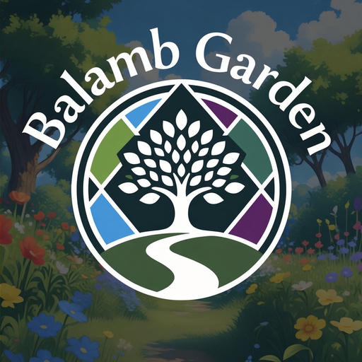

<p align="center">
  
</p>

# Balamb Garden

*Your garden, tended. SeeDs, watered.*

A Dalamud gardening companion for FFXIV housing. Stand by your garden and water, harvest, or replant a whole patch - or every ripe pot in the house - with one button, at a patient human pace.

## What it does

- **One-press Replant ripe** - patches and flowerpots: harvest everything ripe and put the same plant back in, seeds derived from what's growing, soil from your bags. Beds still growing are left alone.
- **Cycle** - the pick-your-seed version: harvest, then replant with the soil and seed you choose.
- **A census ledger** - what's planted where, when you watered it, and when it will be ripe, down to the afternoon ("Tue-Thu afternoon"; exact hours on hover).
- **Flowerpot flowers first-class** - their seeds, their clocks, and observed wilt warnings.
- **Tips** - watches your crossbreed pipelines against live bag contents and says when a chain is about to starve.
- **Auto-filled planting** - the picker fills itself with your named soil and seed and confirms; or hands the picker to you and verifies what you chose.

Everything is receipt-driven: the plugin records what the game actually showed it, never what it guessed. `/garden` to open.

## Install

Add the custom repository in Dalamud Settings -> Experimental -> Custom Plugin Repositories:

```
https://raw.githubusercontent.com/DriftlessDigits/DalamudPluginRepo/main/pluginmaster.json
```

Then install **Balamb Garden** from the plugin installer.

## Build

```
dotnet build BalambGarden -c Debug -p:Platform=x64
```

Engine logic lives in `BalambGarden.Engine` (pure, fully tested); game interaction in `BalambGarden`.

## License

AGPL-3.0-or-later
